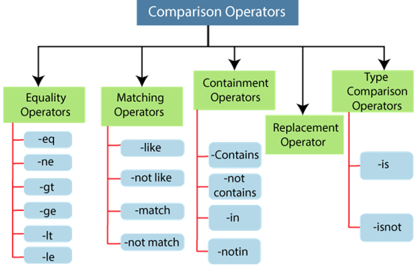

# <span style="color:#e6a40b">PowerShell cheatsheet</span>


## <span style="color:#3ca11d">Hasznos források, példa PS szkriptek:</span>
> http://gitea.vismate.xyz/vismate/powershell-examples


## <span style="color:#3ca11d">Setup</span>

> <span style="color:#abcf1d">Megjegyzés</span>:
>> Ha saját gépen tolod akkor szükséges, alapból tiltva van a .ps1 kiterjesztésű fájlok futtatása.
```ps
~$ Set-ExecutionPolicy Unrestricted # Vagy RemoteSigned
```


## <span style="color:#3ca11d">Szintaxis</span>

> <span style="color:#abcf1d">Megjegyzés</span>:
>> Mivel a PowerShell a <strong><i>.NET</i></strong> keretrendszeren alapszik, így nagyon sok minden megtalálható a PowerShellben is, ami a <strong><i>C#</i></strong>  nyelven való programozásnál is.  
>> <ins><em>Mire gondolok?</em></ins>
>> - Szintaxis: ```;``` (Bár nem kötelező, csak ha több utasítás van egy sorban v. ciklusról van szó)
>> - Namespacek, objektumok, metódusok:
>> - Objektumok után '.' és a Property/Metódus nevével megtudjuk hívni az adott objektumra jellemzőket, pl.: "asd".Count --> Karakterek számát adja vissza
>>  
>> Különbségek:
>> - PowerShell szinte teljesen case-insensitive:
>>> ```$asd = $Asd = $ASD = $aSd```   
>>> ```$xd.ToCharArray() = $xd.tOcHaRArRay() = $xd.TOCHARARRAY()```


| Operátorok |
| :-----: |
```powershell
> #   Negáció --> Zárójelt is lehet használni felkiáltó jel után
# !<feltétel/boolean>

> #   Egyenlőségvizsgáló operátorok:
# -eq --> Egyenlőségvizsgálat
# -ne --> Nem egyenlő
# -gt --> Nagyobb mint
# -ge --> Nagyobb egyenlő
# -lt --> Kisebb mint
# -le --> Kisebb egyenlő

> #   Egyezési operátorok:
# Regex mintákat használ!
# Boolt adnak vissza

> #   Helyettesítő operátor:
# -replace

> #   Stringek összefűzése:
# -join --> Egy string (talán karakter) tömböt összefűz egybe, a jobb oldalán megadott elválasztó string/karakterrel
```



| Deklarálás, változókra hivatkozás |
| :-----: |
```powershell
# Általános forma
# $valtozoNev = <valami objektum/érték>
$var1 = 123
$var2 = "asd"
$var3 = asd # Előzővel ekvivalens
$var4 = 'a'
$var5 = 6.54321

# Lista/tömb --> Nem csak 1 féle típust/objektumot tartalmazhat!!!
$testList = @() # Üres lista/tömb deklarálás
$testList += 123 # Elem listához adása
$testList += 'xd' # Elfogadja hogy nem csak 1 féle adatot tartalmaz
$testList += 1,2,3,4 # Egyszerre több elem listához adása
$testList[x] # Lista x-edik elemére való hivatkozás
$testList[x,y,z] # Lista x, y és z-edik elemére hivatkozás, ebben a sorrendben
$testList[x..y] # Lista x-től y-adik elemére hivatkozás, fordított sorrendben is működik
$testList[-x] # Hátulról x-edik elemre hivatkozás, pl.: -1 -> Utolsó elem
$testList[x..-y] # Fordított sorrendben x-edik elemtől a hátulról y-adik elemig
$testList.Count()

# Hash tábla/Dictionary
$testDict = @{ "key1" = 1; "key2" = 25; "key3" = "test" } # Ilyenkor kulcs érték párokat adunk meg, a kulcs egyedi kell hogy legyen, nem lehet több azonos kulcs egy dictionaryben. Itt is használhatók nem azonos típusú adatok.
$testDict["key4"] = 123 # Így adhatunk új kulcsot és értéket a dictionaryhez
$testDict["key1"] # Így hivatkozunk a dictionary adott kulcsához rendelt értékre
$testDict.key1    # --||--
$testDict.keys # Visszaadja a dictionary összes kulcsát
$testDict.values # Visszaadja a dictionary összes értékét
$testDict.count # Visszaadja a dictionaryben található bejegyzések számát
```


| Ciklusok |
| :-----: |
```powershell
# For
for ($i = 0; $i -lt $valamiMax; $i++) {
    <ciklusmage>
}

$i = 0
for (; $i -lt $valamiMax; $i++) {
    <ciklusmag>
}

# Foreach --> ÉSZREVÉTELEZNI: Nincs akkumulátor!
foreach ($item in $items) { # Itt a $items egy lista/tömb
    <ciklusmag>
}

# While
while (<feltétel>) {
    <ciklusmag>
}

# Do While
do {
    <ciklusmag>
} while (<feltétel>)
```


| Elágazás |
| :-----: |
```powershell
# If-Elseif-Else
if (<feltétel>) {
    <elágazás_művelet>
}
elseif (<feltétel>) {
    <elágazás_művelet>
}
else {
    <elágazás_művelet>
}

# Switch-case
switch [-regex | -wildcard | -exact] [-caseinsensitive] (<érték/kifejezés>) {
    <érték1> {<művelet_1>}
    <érték2> {<művelet_2>}
    default {<művelet_def>}
}
```


| Paraméter(ek) kezelése |
| :-----: |
```powershell
param(
    [<típus>]$név # Megadható típusok: .NET-ben (C#-ban) használtak
    [string]$str # Nem kötelezően megadandó paraméter
    [Parameter(Mandatory=$true)] [int]$n # Kötelezően megadandó paraméterré teszi n-t
    [switch]$Asd # A switch típus: bool, csak azt vizsgálja hogy a paraméterek közt megtalálható-e
    # Olyan mint a Get-ChildItem cmdlet -Recurse switchje.
    # Semmi paraméter csak meg lett e adva a switch
)
```


| Try-catch |
| :-----: |
```powershell
try {
    <esetlegesen_hibát_dobható_művelet>
} catch [<hiba>] {
    <művelet>
    exit <hibakód> # Érdemes használni, ilyenkor nagy eséllyel úgy sem képes hibátlanul lefutni a program
} finally { # A finally használatával bármi is történjék a benne található szkript lefut
    <mindenképp_lefutó_művelet>
}
```


| Throw |
| :-----: |
```powershell
# Olyan hibát dob mivel megállítja a szkript további futtatását
throw # ScriptHalted hibát dob ha semmit nem adsz meg
throw <string/objektum> # Paraméterként megadott stringet v. objektumot dobja hibaként
```


| Trap |
| :-----: |
```powershell
trap [<hiba>] { # Lehet hiba nélkül is megadni ilyenkor bármiféle hiba esetén lefut a benne található szkript
    <művelet>
}
```


| Függvények deklarálása és meghívása |
| :-----: |
```powershell
# Tudnivalók:
#   - Nem kell típusszignatúra, sh/bash szerű
#   - Nem feltétlen szükséges visszaadnia értéket (return), kivéve ha értékadásnál használjuk
#   - Nevesített paraméterkezelés: param()-al vagy azon kívül függvény neve ütán megadva azok típusát és nevét

# Deklarálás
function Valami1 {
    param ( # Nevesített paraméterkezelés függvényben param() használatával
        [int]$param1
        [string[]]$param2
    )

    <művelet>
}

function Valami2 ([int]$param1,[string]$param2){ # Nevesített paraméterkezelés param()-on kívül
    <művelet>
}
```


## <span style="color:#3ca11d">Cmdletek</span>

> <span style="color:#abcf1d">Tudnivalók</span>:
>> - Ezek azok a szaros powershell specifikus parancsok, amikből van egy millió, csak ennek nevezik őket
>> - Elnevezésük sémája (hasznos lehet kereséshez ha ZH-nál elfelejtenétek valamelyiket):
>>
>>     ```<ige>-<főnév>```
>>      - ige: Általában Get, Measure, Sort, Write, ...
>>      - főnév: Object, Item, File, Content, ...
>> - SZŰRŐKÉNT működnek, pipe-al - '|' karakterrel kell őket elválasztani/összekötni, mint shell scriptelésnél
>> - Léteznek aliasjaik, pl.: Get-ChildItem --> dir, ls; Measure-Object --> measure

```powershell
# Mentőövek --> LEGHASZNOSABBAK!!!!
Get-Command # Segítségével lehet keresgélni parancsok közt
Get-Help <cmdlet> # Leírást ad egy adott cmdlet szintaxisáról


# Objektumokkal való dolgozás
New-Object -TypeName <típus_neve> # Új .NET objektum példányt hoz létre

Select-Object # Kiválaszt propertyt adott objektumokból, ha megtalálja azokat a megadott név alapján
#   Kapcsolók:
# -Property <nev>         --> Adott nevű propertyket adja vissza az adott objektumokból, pl.: Get-ChildItem | Select-Object -Property "Name" --> Minden kapott objektumból, ha talál "Name" nevű property-t, akkor visszaadja csak azokat (ezesetben a fájlok és mappák nevét).
# -ExpandProperty <nev>   --> Adott nevű property értékeit adja vissza nem az objektumokat

Where-Object [-Value | -EQ | -NE | ...] <objektum/érték> # Szűr objektumokat a megadott feltételek alapján
#   Kapcsolók:
# -Property <nev>         --> Ha talál olyan objektumot ahol van a megadott property névvel adat, akkor a feltétel alapján visszaadja a feltételre igaz objektumokat
# [-Value | ...] <objektum>       --> KÖTELEZŐ EGYET HASZNÁLNI KÖZÜLÜK!!  

Measure-Object # Objektumok megszámlálására (kapcsolók nélkkül is csinálja), átlagszámításhoz, összegzéshez, max- és minimumkereséshez van
#   Kapcsolók:
# -Property <nev>  --> Ha talál értéket az adott property névvel az objektumokban akkor azokkal dolgozik, pl.: Get-ChildItem | Measure-Object -Property Length --> Megszámolja pl a saját sum propety-jében hány kilistázott objektum fájl.
# -Sum             --> Összegzi a kapott adatokat 
# -Average         --> Átlagot számol
# -Maximum         --> Maximumot keres
# -Minimum         --> Minimumot keres

Sort-Object # Sorba rendez, alapértelmezetten betűrendi sorrendben
# -Descending     --> Fordított sorrend
# -CaseSensitive  --> Kis- és nagybetűérzékenység
# -Unique         --> Csak egyedi objektumok sorba rendezése

Foreach-Object {<műveletek>} # Kapott objektumokon végigfuttatja a {}-ben talált szkriptet, itt egysorban kell írni, így a ';'-t alkalmazni KÖTELEZŐ!!
# FONTOS: $_ -al férünk hozzá a jelenlegi objektumhoz, annak property-jeihez, a '.<property_nev>' módon tudunk hozzáférni


# Adat kiírás/bekérés
Write-Host <string> # Kiír a terminál stdout-jára
Write-Error <uzenet> # Hibát ír ki a stderr-on
Read-Host # Adat bekérése felhasználótól, stdin-en


# Fájlokkal való dolgozás
Get-ChildItem # Kilistázza az adott mappa tartalmát
#   Kapcsolók:
# -Path <string>  --> Útvonal amit kilistázzon
# -Recurse        --> Rekurzívan listázzon ki mappák tartalmát
# -Depth          --> Amilyen mélyen listázzon ki rekurzívan

Test-Path <utvonal> # Megnézi hogy az adott útvonal/fájl létezik e
Get-Content <utvonal> # Beolvassa egy fájl tartalmát
Out-File <utvonal> # Fájlba írás
# Alternatívák, kimenet átirányítás: '>'-al fájlba írás + annak tartalmát felülírja, '>>'-al fájl tartalmához hozzáfűz 
```


## <span style="color:#3ca11d">Alkalmazási példák</span>


| Cmdlet alkalmazási példák |
| :-----: |
```powershell
# Get-ChildItem:    Rekurzívan kilistázza a jelenlegi mappa tartalmát
Get-ChildItem -Recurse

# Get-Content:      Fájl tartalmának kiírása
Get-Content "<utvonal>\<fajlnev>"

# Measure-Object:   Jelenlegi mappában található fájlok méretének összege
Get-ChildItem | Measure-Object -Property Length -Sum

# Where-Object:     Kiválaszt minden olyan objektumot(/fájlt/könyvtárat) melynek a neve (Name property-je) nem asd.txt 
Get-ChildItem | Where-Object -Property Name -ne "asd.txt"

# Sort-Object:      A jelenlegi könyvtár tartalmát a benne található fájlok mérete alapján rakja sorrendbe
Get-ChildItem | Sort-Object -Property Length


# Vegyesválogatott: A paraméterként bekért útvonalnál a megadott mélységig rekurzívan kiszámolja nekünk mekkora helyet foglalnak az adott fájlok
# Észrevettél valami különöset? Miért fogadja el/fut le a szkript hibamentesen?
# Hintek: Select
# Megoldás a fájl végén
param(
    [Parameter(Mandatory=$true)] $path,
    [Parameter(Mandatory=$true)] [int]$depth
)

Get-ChildItem -Path $path -Recurse -Depth $depth | Measure-Object -Property Length -sum | Select -ExpandProperty "Sum" 


# Random órai munka
param([Parameter(Mandatory=$true)] [int]$a,
      [Parameter(Mandatory=$true)] [int]$b
)

trap {
    Write-Error "Nullával való osztás"
    exit 42
}

try {
    $a / $b
    throw New-Object System.Management.Automation.ApplicationFailedException
} catch [System.Management.Automation.ApplicationFailedException] {
    Write-Error "AppFailed"
    exit 42
} catch [System.Management.Automation.RuntimeException]  {
    Write-Error "Runtime"
} finally {
    Write-Host "Xd"
}
```


| Powershell beadandóm mert mért ne |
| :-----: |
```powershell
param (
    [switch] $lista,
    [switch] $szabad,
    [switch] $max,
    [switch] $foglal
)

function FatDatExists {
    if (!(Test-Path FAT.dat)) {
        write-host "Nem létezik az adat.dat fájl."
        exit 1
    }
}

function TryGetFatDatContent {
    FatDatExists

    $content = Get-Content FAT.dat
    return $content
}

function GetFreeBlocks {
    $content = TryGetFatDatContent

    $allocatable = @()
    for ($i = 0; $i -lt $content.Length; $i++) {
        if ($i -eq 0 -or ($i -lt $content.Length-1 -and $content[$i] -eq "S" -and $content[$i+1] -ne "S")) {
            $allocatable += 0
        }
        if ($content[$i] -eq "S") {
            $allocatable[$allocatable.Length-1]++
        }
    }

    return $allocatable
}


if ($lista -and $args.Count -eq 0 -and !($szabad -or $max -or $foglal)) {
    $content = TryGetFatDatContent

    write-host $content
}
elseif ($szabad -and $args.Count -eq 0 -and !($lista -or $max -or $foglal)) {
    $content = TryGetFatDatContent

    $counter = 0
    for ($i = 0; $i -lt $content.Length; $i++) {
        if ($content[$i] -eq "S") {
            $counter++
        }
    }

    write-host "Szabad blokkok száma: $counter"
}
elseif ($max -and $args.Count -eq 0 -and !($lista -or $szabad -or $foglal)) {
    $freeblocks = GetFreeBlocks

    $maximum = 0
    for ($i = 0; $i -lt $freeblocks.Count; $i++) {
        if ($freeblocks[$i] -gt $maximum) {
            $maximum = $freeblocks[$i]
        }
    }

    write-host "Leghoszabb összefüggő szabad blokk: $maximum"
}
elseif ($foglal -and $args.Count -eq 1 -and !($lista -or $szabad -or $max)) {
    $content = (TryGetFatDatContent).ToCharArray()
    $freeblocks = GetFreeBlocks

    $hasmax=$false
    for ($i = 0; $i -lt $freeblocks.Count; $i++) {
        if ($freeblocks[$i] -ge [int]$args[0]) {
            $hasmax = $true
            break;
        }
    }

    if (!$hasmax) {
        write-host "Nincs elég nagy összefüggő szabad blokk."
        exit 1
    }

    $counter=0
    for ($i = 0; $i -lt $content.Count; $i++) {
        if ($content[$i] -eq "S") {
            $counter++;
        }
        else {
            $counter = 0;
        }
        
        if ($counter -eq [int]$args[0]) {
            for ($j = $i; $j -gt $i-[int]$args[0]; $j--) {
                $content[$j] = 'F'
            }
            write-host "Sikeres foglalás"
            
            $content -join "" | out-file -FilePath .\FAT.dat
            exit 0
        }
    }
}
else {
    write-host "Nem megfelelő paraméterek"
    write-host "Használat: [-lista | -szabad | -max | -foglal <blokk_meret>]"
    exit 1
}
```


## <span style="color:#3ca11d">Kérdés megoldása:</span>
> Aliasa a Select a Select-Object-nek